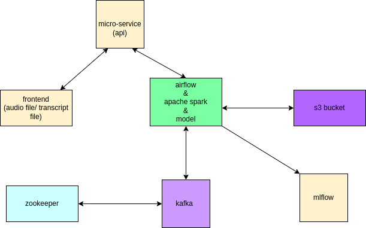

# ETL pipelines for Amharic Speech to Text

## Data pipeline

*Table of content**

 [STT-Data-Collection](#STT-Data-Collection)
  - [Overview](#overview)
  - [Data Source](#data-Source)
  - [Installation Guide](#installation-guide)
  - [Project Structure](#project-structure)
    - 
    - [dags](#dags)
    - [data](#data)
    - [endpoints](#endpoints)
    - [frontend](#frontend)
    - [kafka](#kafka)
    - [logs](#logs)
    - [models](#models)
    - [notebooks](#notebooks)
    - [screenshots](#screenshots)
    - [scripts](#scripts)
    - [tests](#tests)

## Overview

This week, 10 Academy is your client. Recognizing the value of large data sets for speech-t0-text data sets, and seeing the opportunity that there are many text corpuses for both languages, and understanding that complex data engineering skills is valuable to your profile for employers, this week’s task is simple: design and build a robust, large scale, fault tolerant, highly available Kafka cluster that can be used to post a sentence and receive an audio file. 
By the end of this project, you should produce a tool that can be deployed to process posting and receiving text and audio files from and into a data lake, apply transformation in a distributed manner, and load it into a warehouse in a suitable format to train a speech-t0-text model.  

## Data Source

Data source For this Project came from Amharic news text classification dataset with baseline performance [dataset] (https://github.com/IsraelAbebe/An-Amharic-News-Text-classification-Dataset).

##  Requirements

    Install Kafka and run
    Install Airflow 
    Install Spark

## Installation Guide

To install and run this project
        
            git clone https://github.com/STT-data-collection/STT-Data-Collection.git

            cd STT-Data-Collection

            pip install -r requirements.txt
        
  
## Project Structure

### dags 
This folder holds python script files for airflow dags
### data
This folder holds the data of the project (data is store on google drive using DVC)
### endpoints 
This folder holds backend Django apis
### frontend
This folder holds front end of the project using Reactjs
### kafka
This folder holds python script files that define producer , consumer , topic and manage kafka cluster
### logs
This folder holds log data of the projects
### models
This folder holds prediction models
### notebooks
This folder holds demonstrations of the project
### screenshots
This folder holds images of parts of the projects
### scripts
This folder holds prediction model scripts
### tests
This folder holds test files